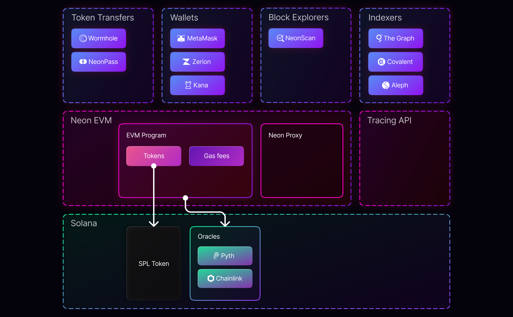

**Neon EVM** is the solution that makes Solana's throughput, swift block speeds, and low gas prices available to Ethereum contracts. Neon EVM interacts directly with a Solana node to carry out txs on Solana. The service is made up of three main components:

- Neon DAO
- Neon EVM
- Neon Proxy

This page presents a high-level overview of each.

## Neon DAO

The DAO essentially owns the Neon EVM and is also a grant-issuing authority able to direct future research and development. The Neon DAO exists as a series of contracts deployed on Solana to provide a Layer 0 (L0, i.e. a social/governance layer) to control the functionality of Neon EVM. The DAO provides a web interface to allow the community, i.e. NEON holders, to raise and vote on proposals that impact the functioning of the Neon EVM.

## Neon EVM smart contract

The **Neon EVM program** is a smart contract on the Solana blockchain. The Neon EVM program accepts Ethereum-like transactions and process them on Solana according to Ethereum rules. Ethereum transactions directed to the Neon EVM are called Neon Transactions. 

> **Neon Transactions**: a [subset of Ethereum's JSON-RPC Specification](/docs/evm_compatibility/json_rpc_api_methods) may be directed to the Neon EVM and these are used as inputs for the targeted Neon clients.

## Neon Proxy

**Neon Proxy** is the "translator', an essential tool for packaging a Neon transaction into a Solana transaction. The proxy provides a containerized solution that is intuitive for [Operators](/docs/operating/overview/introduction) in the Neon ecosystem. It is the Neon Proxy that allows Ethereum dApps to be ported to Neon with virtually no code or configuration changes.

### Neon Token

The Neon Token is a utility token with 2 functions:

#### 1. Payment of gas fees

The Neon Proxy Operator accepts payment from the user in [NEON tokens](/docs/tokens/neon_token) to pay the [gas fees](/docs/tokens/gas_fees) required for transaction execution.

#### 2. Governance

Owners of the Neon token may engage in the Neon DAO activities.

### Neon Operators

**Neon operators** run Neon Proxy servers to facilitate the seamless execution of Ethereum-like transactions on Solana. This allows Ethereum dApps to be ported to Neon with no code change.

## Integrations

**Oracles** provide a way for the decentralized Web3 ecosystem to access price feeds and other external (off-chain) data sources. Neon EVM supports querying data from Solana deployed Oracles:  
* [Chainlink](/docs/developing/integrate/oracles/integrating_chainlink)
* [Pyth](/docs/developing/integrate/oracles/integrating_pyth)

## Native tools

### NeonScan

[NeonScan](https://neonscan.org/) provides a block explorer <!-- Solana explorer?? --> and analytics platform for the Neon ecosystem.

### Tracing API

Neon's Tracing API is an extension for Neon Proxy. It assists developers to test, debug, and understand their smart contracts on Neon EVM. The API provides a full externality trace on any transaction executed on the chain <!-- we do not have a blockchain -- so on Solana or "transaction executed by an Operator" -->. 

The Tracing API supports a rerun of historic transactions, runs transactions on historic states, and analyzes the state of the blockchain <!-- ditto no chain, so Solana state?? --> after the execution of each instruction. 

> More details are available in [our blog](https://medium.com/neon-labs/neon-proxy-tracing-api-fdb3842a80fa)

* [ERC-20 with SPL](/docs/developing/deploy_facilities/interacting_with_spl_tokens) under the hood
* [NeonPass](/docs/token_transferring/neonpass_usage) to transfer tokens between Solana and Neon EVM
