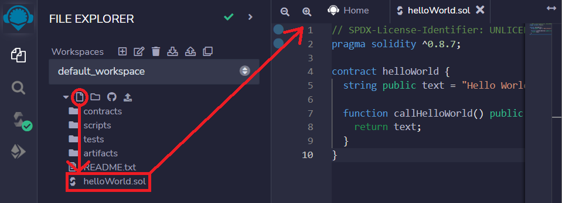
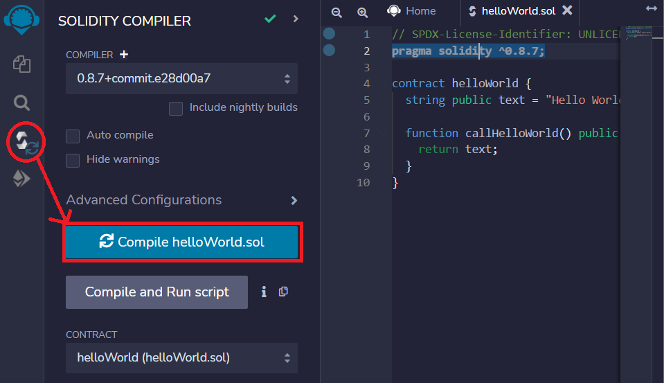
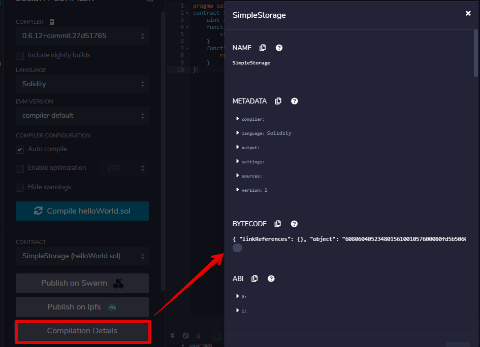
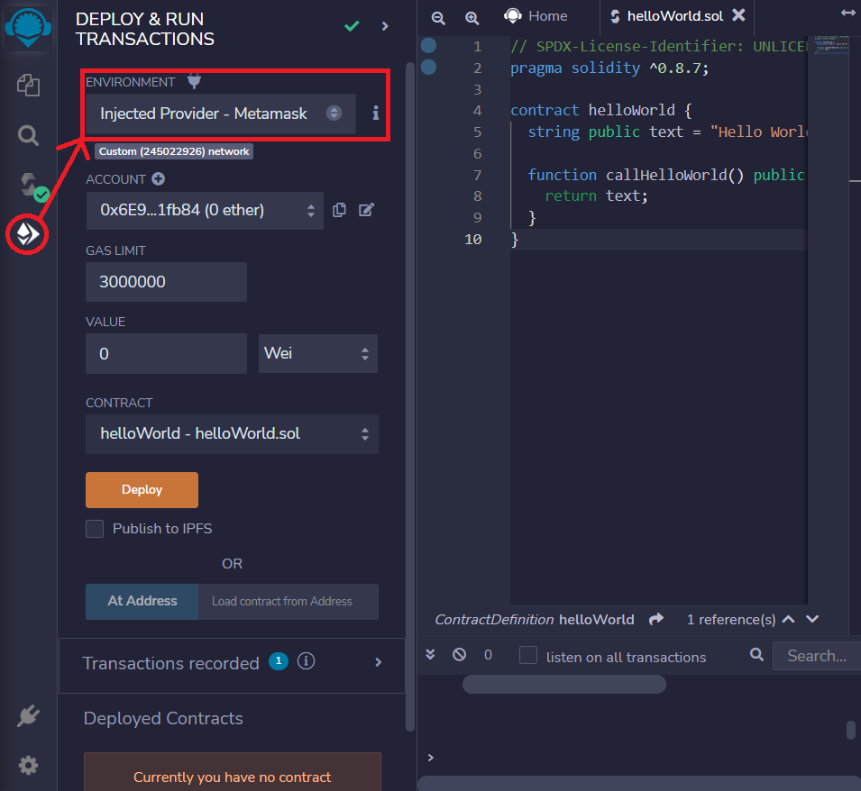
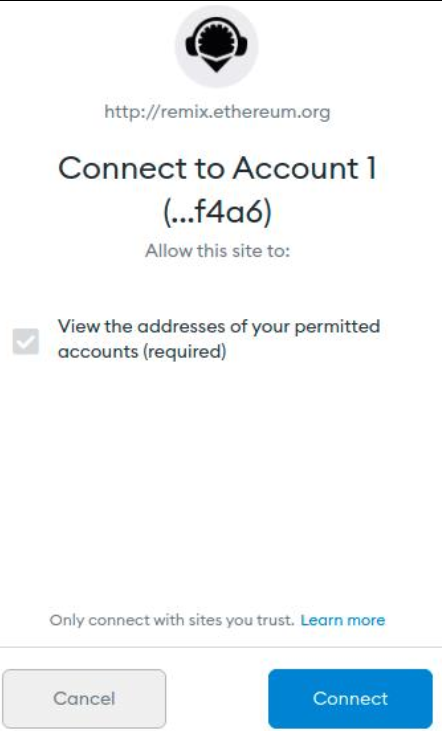
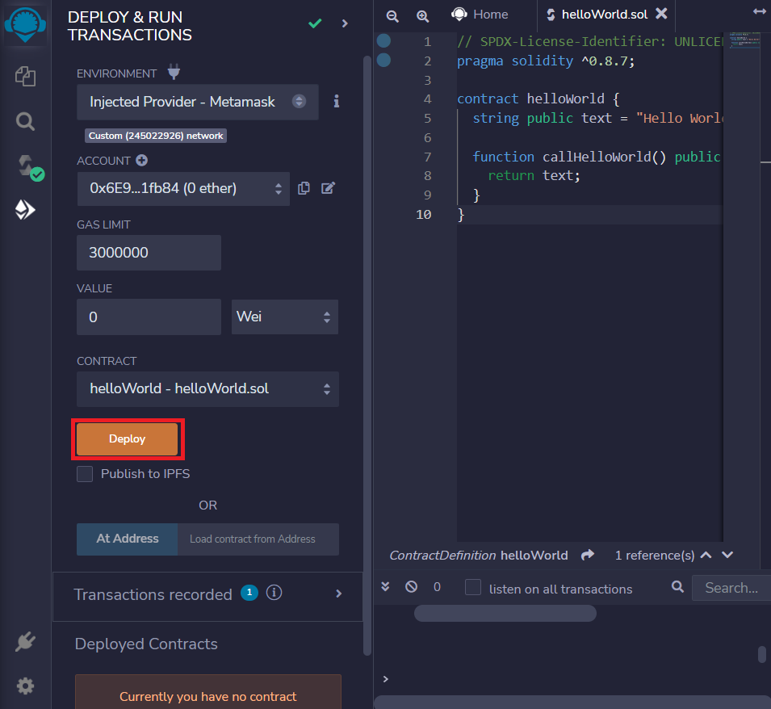
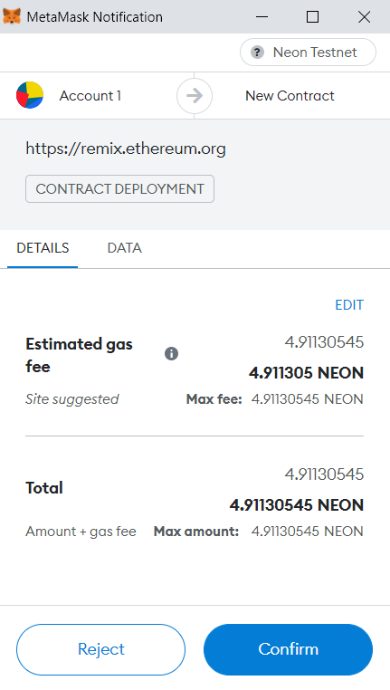
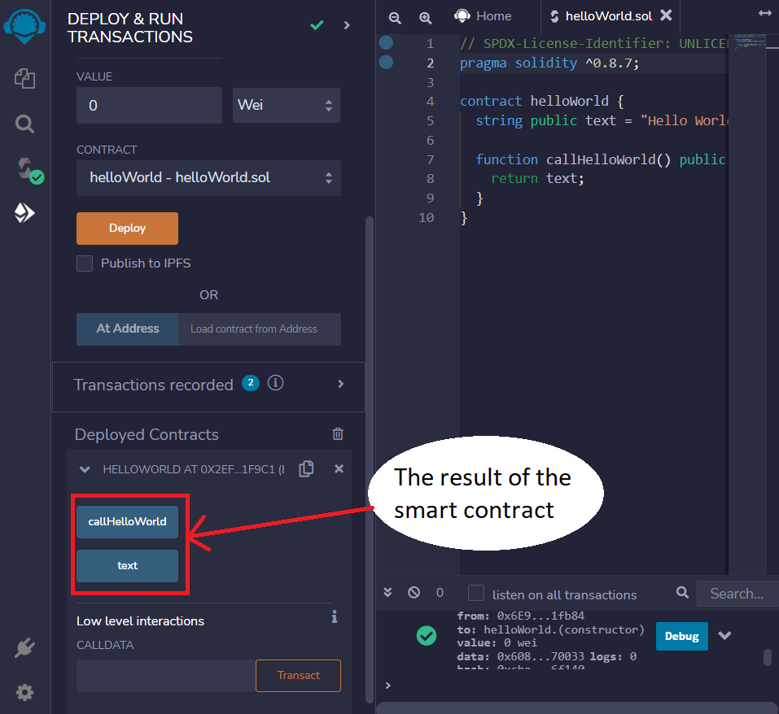

*This tutorial will show you step by step how to use [Remix](about/terminology.md#remix) and [MetaMask](about/terminology.md#metamask) to create and deploy a simple smart contract on Solana. Although the instructions use Solana's [Testnet](https://docs.solana.com/clusters#testnet), they may also be applicable to Solana's [Devnet](https://docs.solana.com/clusters#devnet) or Solana's [Mainnet Beta](https://docs.solana.com/clusters#mainnet-beta).*

## Requirements
Before you start, make sure that the following is true:
  * MetaMask is installed on your device.  
  * You have provided online access to https://remix.ethereum.org to use the "Remix - Ethereum IDE" open-source web application.
  * MetaMask is configured for the Neon EVM.

## Network Configurations
  * [Solana cluster](https://docs.solana.com/clusters) is accessed via a proxy.
  * Solana works in test mode and the proxy interacts with it through the Neon EVM.

### Step 1: Set up the Remix Environment

For Remix to be used to load a smart contract into Neon EVM, Remix must be connected to your MetaMask wallet and run in the `Injected Web3` environment.  

Go to https://remix.ethereum.org and go over the tutorial walkthrough if you are unfamiliar with Remix. Open the `Remix - Ethereum IDE` web application. In the left sidebar menu, select `File explorers`. The `FILE EXPLOPERS` menu will be active (Fig. 1).  

Fig. 1 — Connecting to localhost

### Step 2: Create a Simple Smart Contract in Remix

Click on the icon `Create New File` and type in the file name in the field that appears below it. For example, `helloWorld.sol`.  

At this point, it is an empty file. To fill it with content, click on the created file name and type the text on the right side of the explorer (or copy your pre-prepared text there) (Fig. 2).  

Fig. 2 — Loading the helloWorld smart contract

### Step 3: Compile the Smart Contract

In the left side menu, select the `Solidity compiler`. The `SOLIDITY COMPILER` menu will be active.  

Click on the `Compile helloWorld.sol` button to compile the loaded smart contract helloWorld (Fig. 3).  

Fig. 3 — Compiling helloWorld smart contract

If the compilation is successful, a green icon will appear near the `Solidity compiler` button.  
You can also get detailed information about the compilation process by clicking `Compilation Details` (Fig. 4).  

Fig. 4 — Compilation details

### Step 4: Connect Remix to MetaMask

Interactions with Neon EVM are carried out through MetaMask. Choose the `Injected Web3` environment to connect Remix with an active account in Metamask (Fig. 5).  

Fig. 5 — Injected Web3 connects Remix with an active account in Metamask

The MetaMask window should appear. It will display a list of available accounts, if you have multiple accounts. In our case, only one account will be displayed. Choose this account and click `Next` (Fig. 6).  

Fig. 6 — Selecting an account to interact with Remix

Click `Connect` to connect to this account (Fig. 7).

Fig. 7

### Step 5: Deploy a Smart Contract on Solana Testnet

In the left sidebar menu, select `Deploy & run transactions`. The `DEPLOY & RUN TRANSACTIONS` menu will become active.  

In our case, there is only one smart contract to deploy, therefore it is automatically selected from the dropdown and Remix will automatically generate a transaction.  

The `Account` field will display the amount in the wallet account. This data is taken from MetaMask.  

Click `Deploy` (Fig. 8).  

Fig. 8 — Deploying the smart contract

MetaMask will send a notification in the form of a pop-up window to confirm the transaction. Click `Confirm` to execute it (Fig. 9).  

Fig. 9 — MetaMask notification

Once the transaction is confirmed, you can see its status in the messages on the bottom right (Fig. 10).  

Fig. 10

After successfully deploying the smart contract, you will see a message containing the name and address of the smart contract where it was uploaded (Fig. 11).  

Fig. 11 — Deployed the smart contract data

If all the steps have been completed successfully, a green icon will appear near the `Deploy & run transactions` button (Fig. 12).

Fig. 12 — Final view of the Remix panel

Congratulations! You can now call methods of the helloWorld smart contract deployed on the Solana network. (Fig. 13 shows the result of your smart contract — the text string "Hello World!".)  

Fig. 13 — Calling the smart contract methods

----

> **Useful Links**  
> https://ethereum.org/en/developers/tutorials/deploying-your-first-smart-contract/
