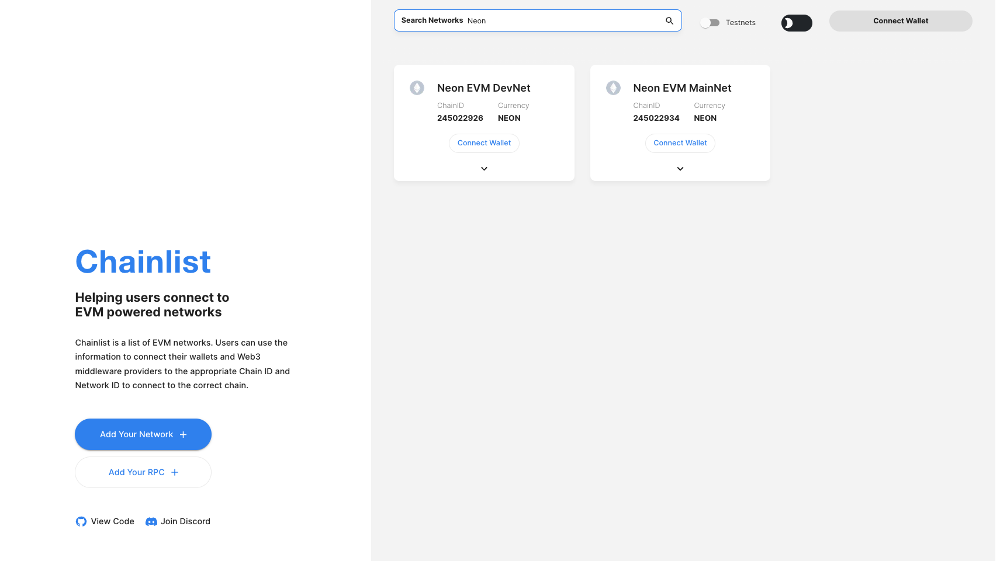

*The purpose of this guide is to get you familiarized with the Neon EVM's high-level structure and to provide you with step-by-step instructions on how to set up your local Neon EVM development environment.*

## Neon vs Ethereum

Ethereum is set to remain a booming blockchain ecosystem. The number of active dApps on Ethereum is hovering above 300, and the number of active users of these dApps is close to 6 million, with the number of transactions continuing to be on the rise. Ethereum’s popularity is not only thanks to its processing of smart contracts, but also its sophisticated infrastructure for application development.

Solana is one of the most technically advanced and innovative blockchains, offering low gas fees and high throughput of transactions. Among these innovations is its Proof-of-Stake (PoS) consensus system, which is reinforced via a Proof-of-History protocol, a transaction parallelization technology that optimizes resources and ensures that Solana can scale horizontally across GPUs and SSDs, along with an optimized mempool system that speeds up throughput.

The Neon EVM is a cross-chain solution that allows dApp developers to access the advantages of Solana to expand their services, to offer new products like arbitrage or high-frequency trading, grow their user base, and decrease costs where possible, including gas fees. Neon EVM enables full compatibility with Ethereum on Solana.

## Quick Start

To get started quickly with Neon, follow the steps below. 

### Step 1: Install MetaMask
Install MetaMask by clicking the "Download now" on [MetaMask's homepage](https://metamask.io/).

### Step 2: Create a New MetaMask Account
Open your MetaMask wallet, and in the upper-right corner, click on the account icon.  
Click `Create Account` in the dropdown menu and create a new account by giving it a descriptive name.

### Step 3: Connect MetaMask to Neon EVM Devnet
In this step, you will connect to the Solana [Devnet](https://docs.solana.com/clusters#devnet) cluster. There are two ways to do so: using Chainlist.org or manually.

#### Option A: Connect with Chainlist.org
Go to [Chainlist](https://chainlist.org/) and type `Neon` in the search bar. You should see `Neon EVM Devnet` and `Neon EVM MainNet`.  

Select `Neon EVM Devnet` and click `Connect Wallet`. A MetaMask pop-up window will show. Click `Next` and then `Connect`. You can now access the [Solana cluster](https://docs.solana.com/clusters) and carry out transactions.

#### Option B: Connect Manually with MataMask
Alternatively, you can connect to Neon EVM Devnet manually via MetaMask. Open your MetaMask wallet under the new account, click `Ethereum Mainnet`, and then click `Add Network` in the dropdown menu. The settings menu window for adding a new network should open in a new page, as follows.  

fill in the fields in the open window as follows:
  * `Network Name`: "remote proxy — solana devnet"
  * `New RPC URL`: `https://proxy.devnet.neonlabs.org/solana`
  * `Chain ID`: 245022926
  * `Currency Symbol`: NEON

After filling in the fields, click `Save`. You can now access the [Solana cluster](https://docs.solana.com/clusters) and carry out transactions.

### Step 5: Migrating the NeonSwap dApp to the Neon EVM

Now that you have your Neon development environment set up, it is time to port a sample dApp, [NeonSwap](about/terminology.md#neonswap), over to Neon. Doing so requires no software code changes and once done the smart contracts will be running on [Solana](https://docs.solana.com/introduction). NeonSwap is a Uniswap v2 fork and an ideal set of contracts to demo how easy migrations can be done. 

For more details, please refer to [🔘 Migrating NeonSwap to the Neon EVM](developing/deploy_facilities/migrating_dapps.md).

## Deploying dApps

Deploying dApps on Neon is easy and you can do so with [Remix](https://remix-project.org/), [Truffle](https://trufflesuite.com/), and [Hardhat](https://hardhat.org/). 

[🔘 Using Remix](developing/deploy_facilities/using_remix.md) — Example of deploying smart contracts using Remix.  
[🔘 Using Truffle](developing/deploy_facilities/using_truffle.md) — Example of deploying smart contracts using Truffle.  
[🔘 Using Hardhat](developing/deploy_facilities/using_hardhat.md) — Example of deploying smart contracts using Hardhat.  

## Fundamental Topics

If you are new to Neon EVM development, we recommend starting from the very beginning and moving forward in order through each of the topics.  

[🔘 Web2 versus Web3](architecture/core_aspects/web3.md) — Describes the fundamental differences between Web2 and Web3.  
[🔘 Ethereum account](architecture/core_aspects/account.md) — An entity with an ETH balance that can send transactions on Ethereum.  
[🔘 Ethereum transaction](architecture/core_aspects/transaction.md) — A cryptographically signed instruction from an account.  
[🔘 Block](architecture/core_aspects/block.md) — A special structure for recording a group of transactions in blockchain systems.  
[🔘 Gas](architecture/core_aspects/gas.md) — Computational power represented in tokens. Required to process transactions.
[🔘 Ethereum and Solana capabilities in a single solution](architecture/eth_sol_solution.md) — Describes a unique solution that allows Ethereum users to use the key features of Solana and vice versa.  
[🔘 Overview of Neon EVM architecture](architecture/neon_evm_arch.md) — Describes the architectural solutions built into Neon EVM that enable fast transaction processing for Ethereum users.  
