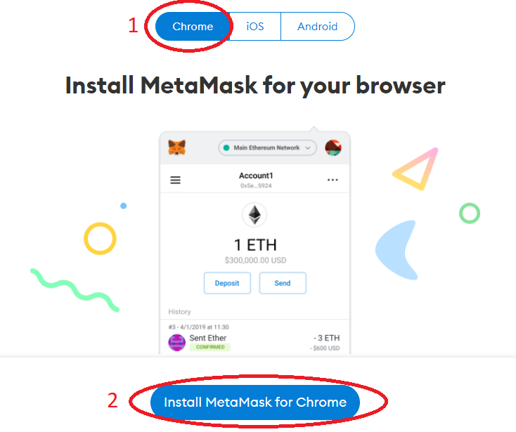
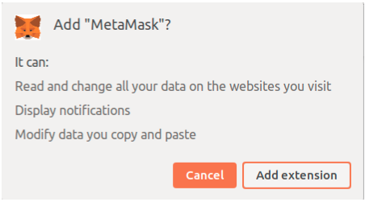
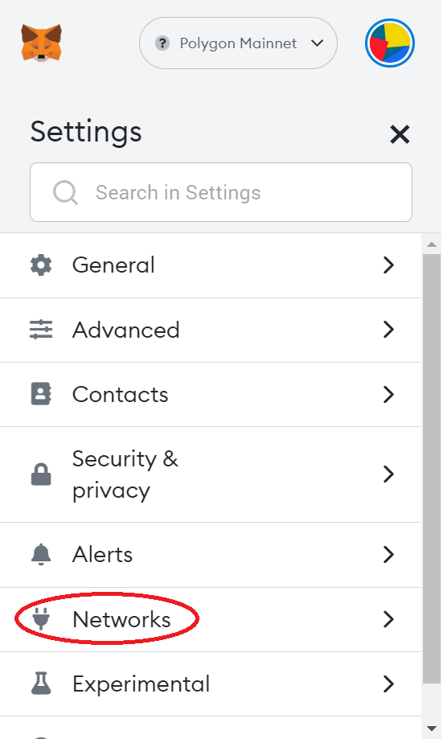

MetaMask is a convenient and fairly easy-to-use application for storing Ethereum addresses and private keys. This tutorial will guide you, step by step, in installing MetaMask on your device and connecting the wallet to the Solana Testnet environment.  

## Device Requirements

A browser that supports MetaMask must be installed on your device. You can use *Chrome*, *Opera*, or *Firefox*.

## Configuring MetaMask

### Step 1: Install MetaMask
Go to the MetaMask [download page](https://metamask.io/download.html). From there, select any platform you use and follow the instructions to load and install MetaMask on your device's browser. (Fig. 1 shows an example of installing MetaMask on the Chrome browser.)  

Fig. 1 — Loading MetaMask

### Step 2: Add the MetaMask Extension
MetaMask is essentially a plugin in the form of an extension to a browser. Therefore, MetaMask can be added to your browser as an extension. In the window, as shown in Fig. 2, click `Add extension`.  

Fig. 2

### Step 3: Create a Wallet
Click on `Create a Wallet`. On the support page, `Help Us Improve MetaMask`, click `I agree`. 

The password generation form should open on the display. Enter a secret code that must contain at least 8 symbols. A secret phrase will be generated automatically. Record the secret phrase for backup (preferably not on a device connected to the Internet). Without this phrase, your funds cannot be refunded if your device is damaged or lost. Confirm that you have written it down on the next page.  

After that, you should see your wallet linked to your account.

### Step 4: Connect MetaMask to a Remote Proxy
There are two ways to connect MetaMask to a remote Neon proxy.

#### Option A: Automatic Setup with Chainlist.org
Go to [Chainlist](https://chainlist.org/) and type `Neon` in the search bar. You should see `Neon EVM Devnet` and `Neon EVM Mainnet`.  

Select `Neon EVM Devnet` and click `Connect Wallet`. A MetaMask pop-up window will show. Click `Next` and then `Connect`. You can now access the [Solana cluster](https://docs.solana.com/clusters) and carry out transactions.

Your MetaMask wallet has been successfully installed, configured, and is ready to use. Enjoy!

#### Option B: Manual Configuration
In MetaMask browser extension's upper-right corner, click the red apple view element. Select "Settings" from the dropdown menu to connect to the proxy server (Fig. 3).  

Fig. 3 — Select "Settings" from the dropdown menu

At this point, a window with the settings menu should open (Fig. 4). Select "Network", and then "Add Network".

Fill in the fields on the next page (Fig. 4):  
* `Network Name`: "Remote Proxy — Solana Devnet"
* `New RPC URL`: https://devnet.neonevm.org
* `Chain ID`: 245022926
* `Currency Symbol`: NEON
* `Block Explorer URL (optional)`: URL of the block browser

> **Note:** The `Chain ID` is specified for [Devnet](https://docs.solana.com/clusters#devnet). To choose [Testnet](https://docs.solana.com/clusters#testnet) or [Mainnet](https://docs.solana.com/clusters#mainnet-beta) in this field, you need to specify the value *245022940* or *245022934*, respectively. The `New RPC URL` must also be changed to either https://testnet.neonevm.org for Testnet, or https://mainnet.neonevm.org for Mainnet.

The wallet settings depend on the values given for the options mentioned above.  

Fig. 6 — Fill in the fields

Click `Save` to keep the settings.  
Your MetaMask wallet has been successfully installed, configured, and is ready to use. Enjoy!
